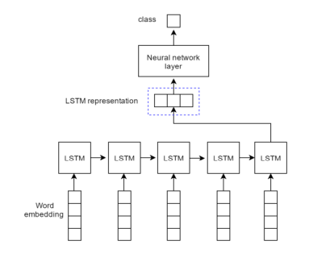
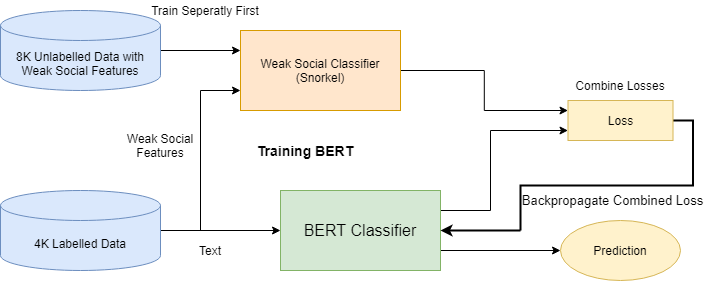
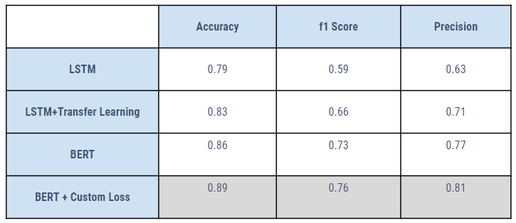

# Hate Speech Detection with Weak Learners

This was a part of a curriculum course - Online Social Network Analysis.

### Abstract

With the advent of online social networks, the social media portals allow users to share their thoughts without much restriction. This freedom sometimes lets users use profanity and derogatory remarks without any consequences eventually spreading negativity in the portal. This calls for portals to detect and take actions against such hate speech and their respective users. But doing so is not an easy task. There have been many rule-based algorithms and NLP based machine learning algorithms for such a classification task. But often this classification task is difficult to implement as the amount of annotated data is very limited. _To tackle this problem, we use the other features that are generally available with social media data such as likes/dislikes, comments, and number of times the data is shared and seen by other users._

### Models used in the experiments

1.  **LSTM**
    -   Embedding Layer Size : 64
    -   Hidden Layer Size : 32
    -   Activation Function : ReLU
    -   
2.  **BERT**
    -   12 - layer BERT Base
    -   Loss Function => $Loss = Loss1 + \alpha\ Loss2$
        -   Loss1 = Categorical Cross Entropy Loss of the BERT Classifer
        -   Loss2 = Categorical Cross Entropy Loss between prediction of the Weak Classifier.
    -   

### Results

### Extra Notes :

- The data used can be found in **/WeakLearners/data/** folder.
- The LSTM code can be found in **/WeakLearners/src/** package.
- The code to train and test the BERT model can be found in **/WeakLearners/BERT/** folder.
- The output LSTM models can be found in **/WeakLearners/models/** folder.
- Code to generate the snorkel labels is in **/WeakLearners/src/notebooks/snorkel.ipynb** notebook.
- Code to fetch tweet data from ids can be found in **/WeakLearners/Tweets/** folder.
